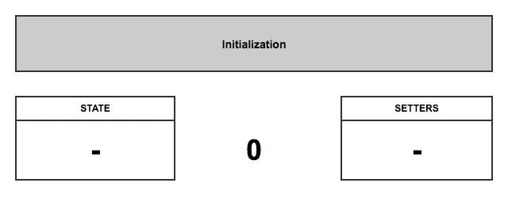
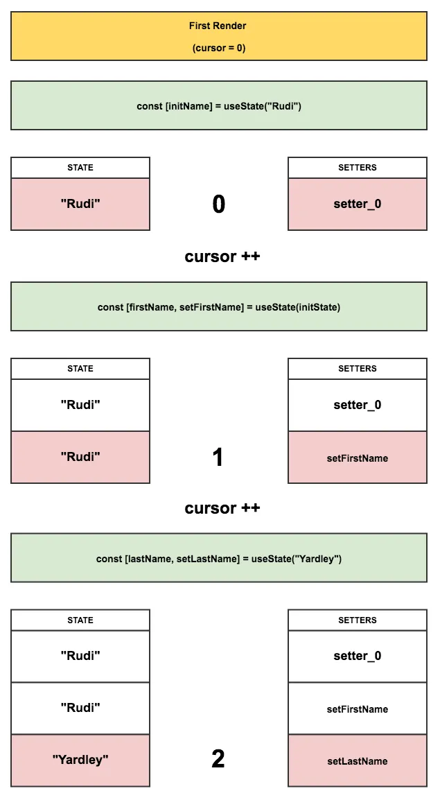

## React는 어떤 state를 반환할지 어떻게 알 수 있을까요?

### `useState` 동작에 대한 아이디어

- closure

```js
let componentHooks = [];
let currentHookIndex = 0;

function useState(initialState) {
  let pair = componentHooks[currentHookIndex];
  if (pair) {
    // 첫번째 렌더가 아니기에 state pair가 이미 존재
    // 해당 pair를 리턴하고 다음 Hook call을 준비
    currentHookIndex++;
    return pair;
  }

  // 처음 렌더링이기에 state pair를 생성하고 저장
  pair = [initialState, setState];

  function setState(nextState) {
    // 유저가 state 변경을 요청할 때 새로운 값을 pair에 넣음
    pair[0] = nextState;
    updateDOM();
  }

  // 미래의 렌더를 위해 pair를 저장하고 다음 Hook call을 준비
  componentHooks[currentHookIndex] = pair;
  currentHookIndex++;

  return pair;
}

function Gallery() {
  const [index, setIndex] = useState(0);
  const [showMore, setShowMore] = useState(false);

  // ...
}

function updateDOM() {
  // 컴포넌트 렌더링 전 current Hook index를 리셋
  currentHookIndex = 0;
  let output = Gallery();

  // ...
}
```

## React hooks: not magic, just arrays

### Hooks의 규칙

> - 반복문, 조건문, 중첩함수 내부에서 Hooks를 호출하지 마세요.
> - React Function에서만 Hooks를 호출하세요.

### React 안에서 useState의 동작

1. 초기화 - setters와 state 두 개의 배열 생성 - cursor를 0으로 맞춤
   
2. 첫 번째 렌더 - 컴포넌트 함수 처음 실행 - 각 useState는 setter 함수(cursor 위치가 바인딩 된)를 setters 배결에 푸쉬 - state 배열에 state 푸쉬
   
3. 후속 렌더 - 후속 렌더마다 cursor는 초기화되고 해당하는 값들은 각 배열로부터 가져와짐
   
4. 이벤트 핸들링 - 각 setter는 자신의 cursor 위치에 대한 reference를 가지고 있으므로, 어떤 setter 호출이 발생하면 state 배열에서 해당 위치의 state 값을 수정할 수 있음
   

### 조건문 안에 useState를 넣는다면

```tsx
let firstRender = true;

function RenderFunctionComponent() {
  let initName;

  if (firstRender) {
    [initName] = useState("Rudi");
    firstRender = false;
  }
  const [firstName, setFirstName] = useState(initName);
  const [lastName, setLastName] = useState("Yardley");

  return <Button onClick={() => setFirstName("Fred")}>Fred</Button>;
}
```

1. 첫 번째 렌더 - name, firstName, lastName state 정의
   
2. 두 번째 렌더 - firstName, lastName에 name, firstName state 반환
   

### 반복문 안에 useState를 넣는다면

- 그냥 useState 값을 배열로 하자.

```tsx
function RenderFunctionComponent() {
  let firstName = [],
    setFirstName = [],
    lastName = [],
    setLastName = [];

  for (let i = 0; i < 3; i++) {
    [firstName[i], setFirstName[i]] = useState("Rudi");
    [lastName[i], setLastName[i]] = useState("Yardley");
  }

  return <Button onClick={() => setFirstName[0]("Fred")}>Fred</Button>;
}
```
